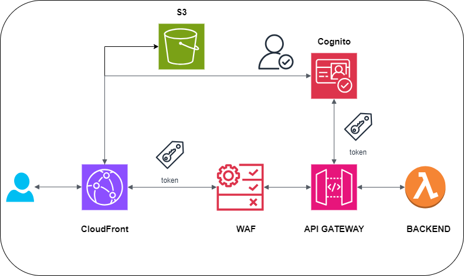

# Full Stack Serverless CI/CD Pipeline AWS and Terraform

[]

# Steps to reproduce

1. Clone this repository with all branches (main and dev) or create a new repository with the same structure
   Note that dev branch is used to deploy the dev environment and main branch is used to deploy the prod environment
   Each branch has its own CI/CD pipeline

2. Set secrets on GitHub

```bash
   AWS_ACCESS_KEY_ID=your_aws_access_key_id
   AWS_SECRET_ACCESS_KEY=your_aws_secret_access_key
   INFRACOST_API_KEY=your_infracost_api_key
   REPO_TOKEN=your_github_token_with_repo_permissions_and_pull_requests_comments
```

3. Apply backend configuration

```bash
# cd infra/environments/backend
# fill in the backend.auto.tfvars file
terraform init
terraform apply -auto-approve
```

4. Fill auto.tfvars file with your values

```bash
# environments/dev/variables.auto.tfvars
```

5. Test the code:

- Push a commit to the dev branch and check the pipeline output and resources created in aws
- Create a pull request from dev to main and check the pipeline output
- Merge the pull request and check the pipeline output and resources created in aws

Expected resources created in AWS:
- S3 bucket for hosting the frontend
- CloudFront distribution for the frontend
- API Gateway for the backend
- Lambda function for the backend
- Waf ACL and Waf Rule for the API Gateway
- Cognito User Pool for the frontend

6. Destroy the infrastructure

```bash
# cd infra/environments/dev
terraform destroy -auto-approve

# cd infra/environments/prod
terraform destroy -auto-approve

# cd infra/environments/backend
terraform destroy -auto-approve
```